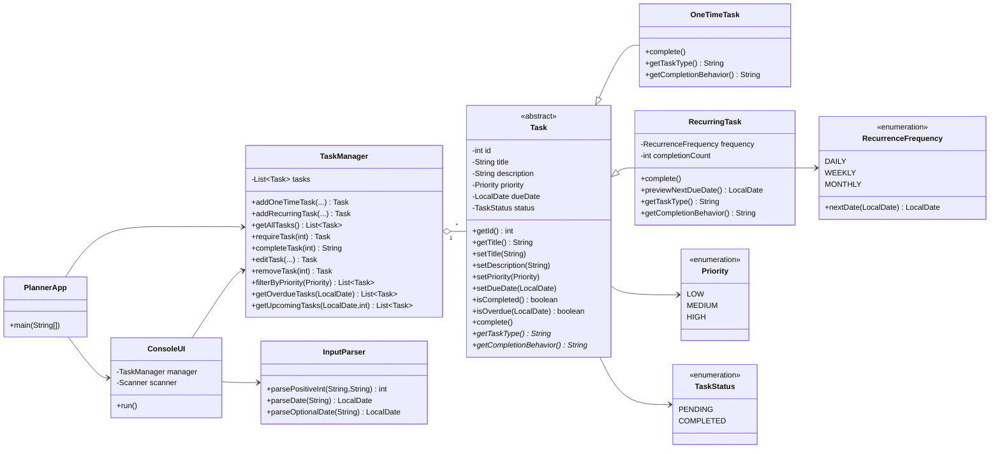

# UML Class Diagram

## Package Organization

- **planner.model**: Task, OneTimeTask, RecurringTask, Priority, TaskStatus, RecurrenceFrequency
- **planner.service**: TaskManager
- **planner.console**: PlannerApp, ConsoleUI, InputParser
